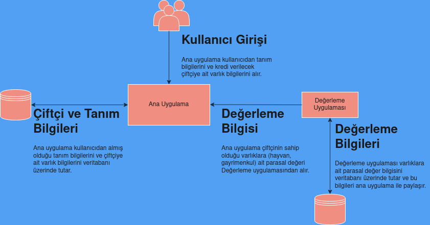
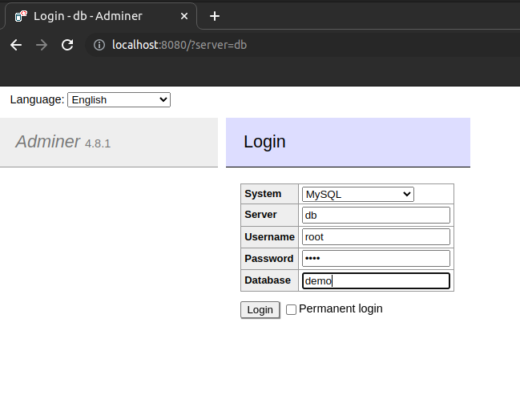
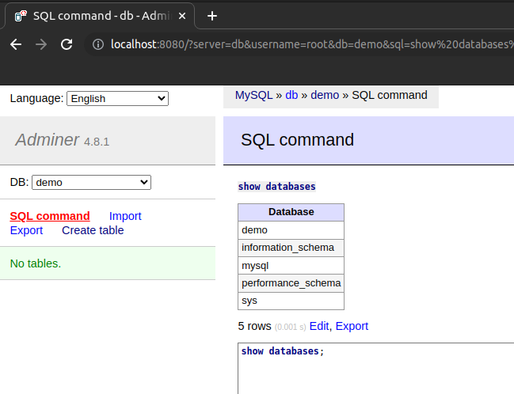
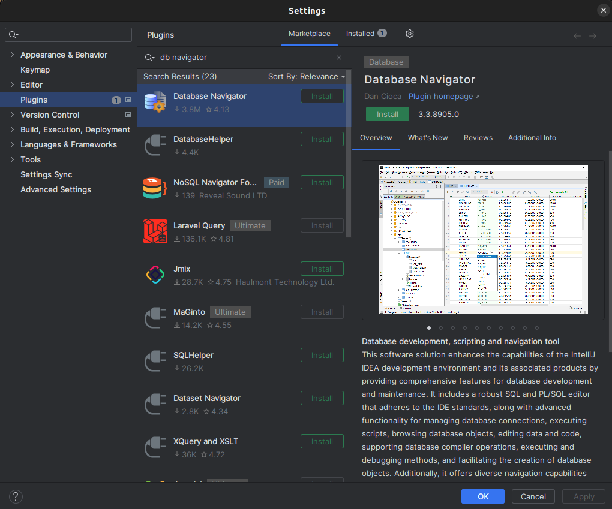
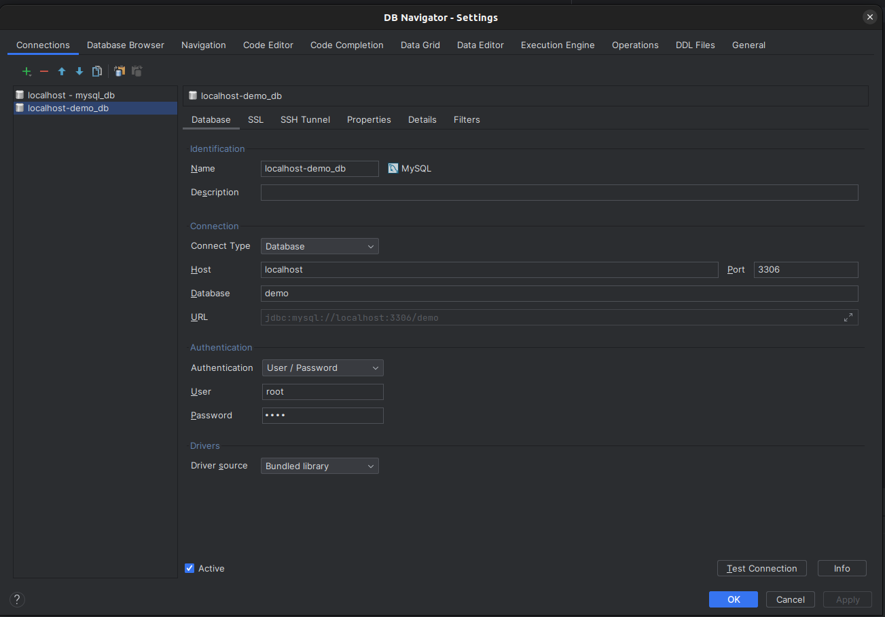
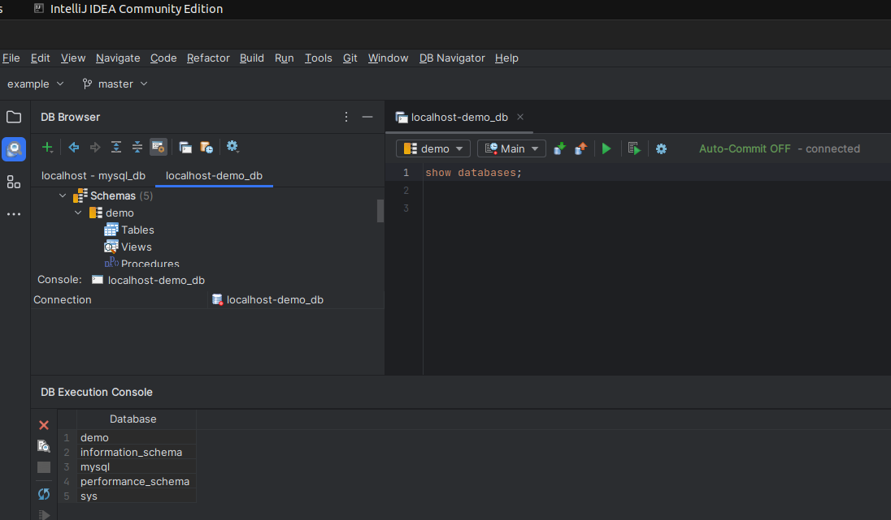
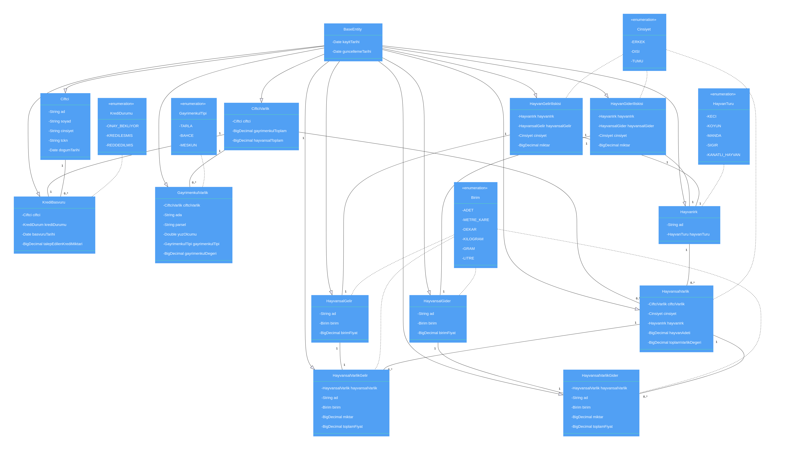
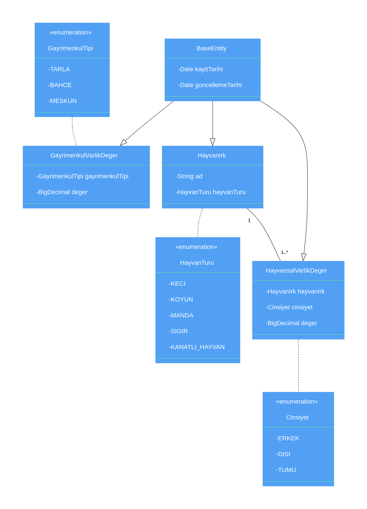
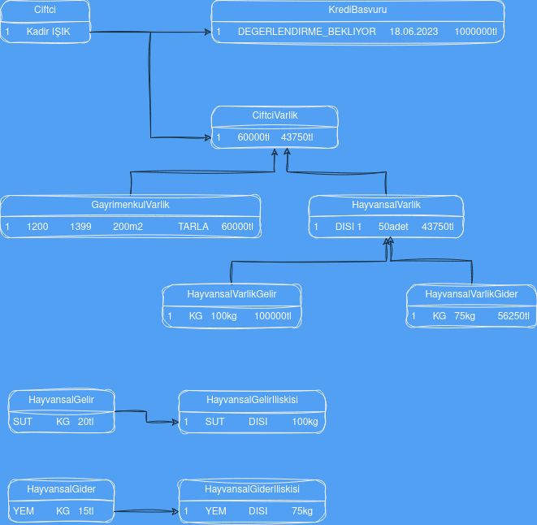
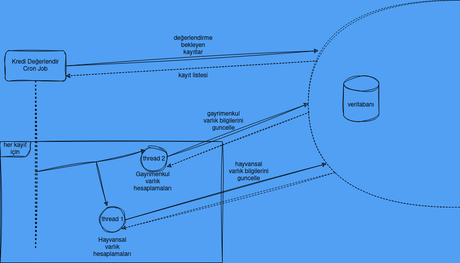

# Proje Tanımı
Çiftçiler için kredi değerlemesi yapan basit bir backend uygulamasının yazılması hedeflenmektedir.

Proje kapsamında Ana ve Değerleme olmak üzere iki adet uygulama geliştirilecektir. Değerleme uygulaması varlık (hayvan ya da gayrimenkul) tiplerine göre parasal değer verisi sağlayacak. Ana uygulama ise ilgili tanım kayıtlarının oluşturulması, çiftçiye ait varlıkların değerinin hesaplanması ve bu değer doğrultusunda kredi tespit işleminin yapılmasını sağlayacaktir. Sistem yapısı çok basit haliyle aşağıdaki gibi olacaktir:



***

# Projede takip edilecek takvim

| Hafta # | Yapılacak İşlerin Tanımı                                                                                                                                                                                                                                                                                                                              |
|---------|-------------------------------------------------------------------------------------------------------------------------------------------------------------------------------------------------------------------------------------------------------------------------------------------------------------------------------------------------------|
| 1       | <ul><li>`Çalışma öncesi gerekli okumaların yapılması`</li><li>`Ortam kurulumlarının tamamlanması`</li><li>`Değerleme uygulaması entity ve relation'larının oluşturulması`</li></ul>                                                                                                                                                                   |
| 2       | Değerleme uygulaması için; </br><ul><li>`Ana uygulama ile entegre olunacak rest endpoint tanımlarının yapılması`</li><li>`Varlık değerlerini guncelleyecek cron job'ların implement edilmesi`</li></ul> işlemlerinin yapilmasi <br/><br/> Ana uygulama için; <br/><ul><li>`Entity ve relation'larının oluşturulması`</li></ul> işlemlerinin yapilmasi |
| 3       | Ana uygulama için; </br><ul><li>`Rest endpoint'lerinin tanımlanması`</li><li>`Değerleme uygulaması ile entegre olup çiftçi varlık bilgilerinin hesaplanması`</li><li>`Çiftçi kredi onay başvurusunun sonuçlandırılması`</li></ul> işlemlerinin yapilmasi                                                                                              |
| 4       | `Ana uygulama ve Değerleme uygulaması için iyileştirme ve hata düzeltmelerinin yapılması`                                                                                                                                                                                                                                                             |

***

# Ön Hazırlık
### Çalışma öncesi faydalı olacak okumalar
+ [OOP Principles](https://khalilstemmler.com/articles/object-oriented/programming/4-principles/)
+ [SOLID Türkçe kaynak](http://aliozgur.net/2018/03/02/solid)
+ [SOLID İngilizce kaynak](https://www.digitalocean.com/community/conceptual-articles/s-o-l-i-d-the-first-five-principles-of-object-oriented-design)
+ [Design Patterns](https://refactoring.guru/design-patterns)
+ [Clean Code](https://betterprogramming.pub/12-conventions-for-writing-clean-code-e16c51e3939a)
+ [YAGNI](https://martinfowler.com/bliki/Yagni.html)
+ [DRY](https://en.wikipedia.org/wiki/Don%27t_repeat_yourself)
+ [KISS](https://en.wikipedia.org/wiki/KISS_principle)
+ [Defensive Programming](https://en.wikipedia.org/wiki/Defensive_programming)
+ [Offensive Programming](https://en.wikipedia.org/wiki/Offensive_programming)
+ [Early Return](https://medium.com/swlh/return-early-pattern-3d18a41bba8)
+ [IoC & DI in Spring](https://www.baeldung.com/inversion-control-and-dependency-injection-in-spring)
+ [Spring Bean](https://www.baeldung.com/spring-bean)
+ [Hibernate Caching](https://www.digitalocean.com/community/tutorials/hibernate-caching-first-level-cache)
+ [Entity Stage Transition in Hibernate](https://www.digitalocean.com/community/tutorials/hibernate-caching-first-level-cache)
+ [Cascade Types](https://www.baeldung.com/jpa-cascade-types)
+ [Spring Bean Scopes](https://www.baeldung.com/spring-bean-scopes)
+ [Spring Stereotype](https://howtodoinjava.com/spring-core/stereotype-annotations/)
+ [Spring Transactions](https://www.baeldung.com/transaction-configuration-with-jpa-and-spring)
+ [Spring Transaction Propagation & Isolation](https://www.baeldung.com/spring-transactional-propagation-isolation)
+ [Spring Transaction Management](https://docs.spring.io/spring-framework/reference/data-access/transaction.html)
+ [Lost Update Problem](https://www.javacodemonk.com/prevent-lost-updates-in-database-transaction-using-spring-hibernate-f16d36d5)
+ [Optimistic Locking in JPA](https://www.baeldung.com/jpa-optimistic-locking)
+ [Pesimistic Locking in JPA](https://www.baeldung.com/jpa-pessimistic-locking)
+ [Spring jpa flush](https://www.baeldung.com/spring-jpa-flush)
+ [Jpa join types](https://www.baeldung.com/jpa-join-types)
+ [Spring Boog OSIV](https://www.baeldung.com/spring-open-session-in-view)
+ [N+1 problem](https://vladmihalcea.com/n-plus-1-query-problem/)
+ [Spring Security](https://www.marcobehler.com/guides/spring-security)

### Geliştirmeler esnasında kullanılacak ortamların kurulumu sağlanmalı
+ [Intellij IDEA Community Edition](https://www.jetbrains.com/idea/download)
+ [Git](https://git-scm.com/book/en/v2/Getting-Started-Installing-Git)
+ [Postman](https://www.postman.com/downloads/)
+ Veritabanı için projeye basit bir mysql [docker-compose dosyası](./resources/docker/mysql/docker-compose.yml) koyuldu. Bunun için öncelikle doker ve docker-compose kurulumlarının yapılması gerekiyor. Kurulumlar sonrasında **docker-compose.yml** dosyasının olduğu dizinde aşağıdaki komut çalıştırıldığında myslq container'ı ayağa kalkacaktır.
  ```bash
  sudo docker-compose up -d 
  ```
  Veritabanı yönetim ekranı için browser üzerinden [Adminer](http://localhost:8080/)'e root/root username/password'ü ile login olunur.

  

  Login sonrasında **SQL command**'a tıklanır ve açılan pencerede aşağıdaki komut çalıştırılır.
  ```
  show databases; 
  ```
  Komut çalıştırıldığında aşağıdaki gibi bir görüntü elde ediliyorsa mysql sorunsuzca ayağa kalkmış demektir. 

  

  Servisleri durdurmak için aynı şekilde **docker-compose.yml** dosyasının olduğu dizinde aşağıdaki komut çalıştırılır.
  ```bash
  sudo docker-compose stop 
  ```
  Veritabanı erişimi için istenirse [Adminer](http://localhost:8080/)'e alternatif olarak Intellij Plugin'i olan **Database Navigator** da kullanılabilir.

  

  **Database Navigator** Plugin'ı kurulumu sonrası veritabanı bağlantı ayarları yapılır.

  

  > Linux ortamında **Database Navigator** Plugin'in çalışması için **sqlite3** kurulumu gerekebilir.
  > ```bash
  > sudo apt install sqlite3
  > ``` 

  Kurulum yapıldıktan ve sorunsuz bağlantı sağlandıktan sonra **show databases;** komutu çalıştırılır ve Adminer'de olduğu gibi bir sonuç beklenir.

  

# Version Control (Git)
Projede versiyon kontrol sistemi olarak Git kullanılacak. Tüm Git komutları `command prompt` (Git Bash) üzerinden çalıştırılacaktır (conflict çözümleri ide üzerinden yapılabilir). Geliştirme süresince her hafta için yeni bir branch oluşturulacak ve geliştirmeler o branch üstünde yapılacak. O hafta bitiminde yapılmış olan değişikler için `master` branch'ine pr (pull request) açılacak. Yararlı olabilecek Git comutları:
* init
* add
* rm
* commit
* checkout
* branch
* status
* pull
* push
* fetch
* log
* cherry-pick
* stash
* reflog
* reset
* tag
* merge
* rebase

# Sistem Tasarımı
Basitlik açısından ana uygulama ve değerleme uygulaması aynı veri tabanını kullanabilir. İstendiği taktirde veritabanları ayrılabilir ancak bu durumda ana uygulamada oluşturulan tanımların değerleme uygulamasının kullanacağı veritabanına aktarımlası gerekecektir. Ayrı veritabanı kullanıldığı taktirde bu durum göz önünde bulundurulmalıdır.

### Class Diagram
Gerçeklenecek olan sistem için sınıflara ait class diagram aşağıdaki gibi olmalıdır. Belli bir mantık çerçevesinde class'lar arası ilişkiler değiştirilebilir. Eksik olduğu düşünülen class, enumaration tanımları eklenebilir. Bu konuda olabildiğince serbest şekilde değişiklik kararı alınabilir.

#### Ana Uygulama


#### Degerleme Uygulamasi


Projede entity'ler arası kurulucak ilişkiler için [Entity relationships](https://www.baeldung.com/spring-data-rest-relationships) yazısından faydalanılabilir. Projeye Many-to-One ilişkisine örnek teşkil edecek Commit-PullRequest entity'leri eklenmiştir: [Commit](./src/main/java/com/cks/example/entity/Commit.java), [PullRequest](./src/main/java/com/cks/example/entity/PullRequest.java).

Kurgulanmak istenen sistemin daha anlaşılır olması için aşağıdaki örnek veriler incelenebilir.



HayvanIrk tablosu için örnek veri oluşturmada zorluk yaşanırsa aşağıdaki veriler kullanılabilir.

| Hayvan Irk         | Hayvan Türü |
|--------------------|-------------|
| Zavot              | Sığır       |
| Yerli Güney Sarısı | Sığır       |
| Yerli Kara         | Sığır       |
| Boz Irk            | Sığır       |
| Hasmer M           | Koyun       |
| Malya M            | Koyun       |
| Dorset Down        | Koyun       |
| Dorper             | Koyun       |
| Turcana            | Koyun       |
| Akkeçi             | Keçi        |
| Honamli Keçisi M   | Keçi        |
| Ankara (Tiftik) M  | Keçi        |
| Damascus M         | Keçi        |
| İtalyan Mandası    | Manda       |

### İmplement edilmesi gereken endpoint'ler
Tüm endpointler için gelen request'lerde `x-secure-key` header'ı ve bu header için `6RcVRuwxUr07F54B7a9IPomjh` değeri setlenmiş olmalı. Bu header bilgisi olmayan ya da faklı bir değere sahip olan request'ler için `401 Unauthorized` yanıtı dönülecektir. Uygulamaya gelen request'leri filtrelemek için [OncePerRequestFilter](https://www.baeldung.com/spring-onceperrequestfilter) yazısından faydalanılabilir. Servis çağırımlarının nasıl yapılacağına dair örnek olması açısından projeye eklenen [WebClientConfig](./src/main/java/com/cks/example/config/WebClientConfig.java), [PingJob](./src/main/java/com/cks/example/job/PingJob.java), [PingController](./src/main/java/com/cks/example/controller/PingController.java) dosyaları incelenebilir.

#### Ana Uygulama

----------------------------------------------------------------------------------------------------

<details>
 <summary><code>POST</code> <code><b>/ciftci-yonetimi</b></code> <code>(Sisteme yeni bir çiftçi eklenmek istediğinde bu endpoint kullanılacak)</code></summary>

##### Parameters

> | required | data type     | description                                                       |
> |----------|---------------|-------------------------------------------------------------------|
> | required | object (JSON) | Çiftçi nesnesi için zorunlu tüm alanlar parametre olarak alınmalı |


##### Responses

> | http code | content-type               | response                                  |
> |-----------|----------------------------|-------------------------------------------|
> | `201`     | `text/plain;charset=UTF-8` | `Çiftçi başarılı bir şekilde oluşturuldu` |
> | `401`     | `text/plain:charset=UTF-8` | `Unauthorized`                            |
> | `422`     | `application/json`         | `{"code":"422","message":"Hata mesajı"}`  |

##### Example cURL

> ```javascript
> curl -H "x-secure-key:6RcVRuwxUr07F54B7a9IPomjh" -X POST -H "Content-Type: application/json" --data '{"ad": "Kadir", "soyad": "IŞIK", "cinsiyet": "ERKEK", "tckn":"32555486176", "dogumTarihi": "1992-01-01"}' http://localhost:8090/ciftci-yonetimi
> ```

</details>

<details>
 <summary><code>POST</code> <code><b>/ciftci-yonetimi/yukle</b></code> <code>(Sisteme toplu olarak çiftçi eklenmek istediğinde bu endpoint kullanılacak)</code></summary>

##### Parameters

> | required | data type     | description                                                          |
> |----------|---------------|----------------------------------------------------------------------|
> | required | object (file) | Çiftçi nesnesi için zorunlu tüm alanları içeren csv formatında dosya |


##### Responses

> | http code | content-type               | response                                 |
> |-----------|----------------------------|------------------------------------------|
> | `201`     | `text/plain;charset=UTF-8` | `Başarılı bir şekilde oluşturuldu`       |
> | `401`     | `text/plain:charset=UTF-8` | `Unauthorized`                           |
> | `422`     | `application/json`         | `{"code":"422","message":"Hata mesajı"}` |

##### Example cURL

> ```javascript
> curl -H "x-secure-key:6RcVRuwxUr07F54B7a9IPomjh" -H "Content-Type:multipart/form-data" -X POST -F "file=@/home/user/Desktop/game.csv" http://localhost:8090/ciftci-yonetimi/yukle
> ```

</details>

<details>
 <summary><code>GET</code> <code><b>/ciftci-yonetimi/ciftciler</b></code> <code>(Sistemde var olan çiftçi bilgileri istediğinde bu endpoint kullanılacak)</code></summary>

##### Parameters

> | required | data type     | description                                                       |
> |----------|---------------|-------------------------------------------------------------------|


##### Responses

> | http code | content-type               | response                         |
> |-----------|----------------------------|----------------------------------|
> | `200`     | `text/plain;charset=UTF-8` | `Json formatında çiftçi listesi` |
> | `401`     | `text/plain:charset=UTF-8` | `Unauthorized`                   |

##### Example cURL

> ```javascript
> curl -H "x-secure-key:6RcVRuwxUr07F54B7a9IPomjh" -X GET -H "Content-Type: text/plain;charset=UTF-8" http://localhost:8090/ciftci-yonetimi/ciftciler
> ```

</details>

<details>
 <summary><code>GET</code> <code><b>/ciftci-yonetimi/ciftciler/{id}</b></code> <code>(Sistemde var olan spesifik id'li çiftçinin bilgileri istediğinde bu endpoint kullanılacak)</code></summary>

##### Parameters

> | required | data type | description             |
> |----------|-----------|-------------------------|
> | required | int       | Çiftçiye ait id bilgisi |

##### Responses

> | http code | content-type               | response                                 |
> |-----------|----------------------------|------------------------------------------|
> | `200`     | `text/plain;charset=UTF-8` | `Json formatında çiftçi bilgisi`         |
> | `401`     | `text/plain:charset=UTF-8` | `Unauthorized`                           |
> | `422`     | `application/json`         | `{"code":"422","message":"Hata mesajı"}` |

##### Example cURL

> ```javascript
> curl -H "x-secure-key:6RcVRuwxUr07F54B7a9IPomjh" -X GET -H "Content-Type: text/plain;charset=UTF-8" http://localhost:8090/ciftci-yonetimi/ciftciler/1
> ```

</details>

----------------------------------------------------------------------------------------------------

<details>
 <summary><code>POST</code> <code><b>/kredi-yonetimi</b></code> <code>(Sistemde var olan bir çiftçi kredi başvurusunda bulunduğunda bu endpoint kullanılacak)</code></summary>

##### Parameters

> | required | data type     | description                                                             |
> |----------|---------------|-------------------------------------------------------------------------|
> | required | object (JSON) | KrediBasvuru nesnesi için zorunlu tüm alanlar parametre olarak alınmalı |


##### Responses

> | http code | content-type               | response                                           |
> |-----------|----------------------------|----------------------------------------------------|
> | `201`     | `text/plain;charset=UTF-8` | `Kredi başvurusu başarılı bir şekilde oluşturuldu` |
> | `401`     | `text/plain:charset=UTF-8` | `Unauthorized`                                     |
> | `422`     | `application/json`         | `{"code":"422","message":"Hata mesajı"}`           |

##### Example cURL

> ```javascript
> curl -H "x-secure-key:6RcVRuwxUr07F54B7a9IPomjh" -X POST -H "Content-Type: application/json" --data '{"ciftciId": "1", "talepEdilenKrediMiktari": "1750000"}' http://localhost:8090/kredi-yonetimi
> ```

</details>

<details>
 <summary><code>POST</code> <code><b>/kredi-yonetimi/{id}/degerlendir</b></code> <code>(Sistemde var olan kredi başvurusunun değerlendirilmesi istendiğinde bu endpoint kullanılacak)</code></summary>

##### Parameters

> | required | data type | description                      |
> |----------|-----------|----------------------------------|
> | required | int       | Kredi başvurusuna ait id bilgisi |


##### Responses

> | http code | content-type               | response                                            |
> |-----------|----------------------------|-----------------------------------------------------|
> | `200`     | `text/plain;charset=UTF-8` | `Başvuru DEGERLENDIRME_BEKLIYOR durumuna getirildi` |
> | `401`     | `text/plain:charset=UTF-8` | `Unauthorized`                                      |
> | `422`     | `application/json`         | `{"code":"422","message":"Hata mesajı"}`            |

##### Example cURL

> ```javascript
> curl -H "x-secure-key:6RcVRuwxUr07F54B7a9IPomjh" -X POST -H "Content-Type: application/json" http://localhost:8090/kredi-yonetimi/1/degerlendir
> ```

</details>

<details>
 <summary><code>GET</code> <code><b>/kredi-yonetimi/krediler</b></code> <code>(Sistemde var olan kredi başvuru bilgileri istediğinde bu endpoint kullanılacak)</code></summary>

##### Parameters

> | required | data type     | description                                                       |
> |----------|---------------|-------------------------------------------------------------------|


##### Responses

> | http code | content-type               | response                                |
> |-----------|----------------------------|-----------------------------------------|
> | `200`     | `text/plain;charset=UTF-8` | `Json formatında kredi başvuru listesi` |
> | `401`     | `text/plain:charset=UTF-8` | `Unauthorized`                          |

##### Example cURL

> ```javascript
> curl -H "x-secure-key:6RcVRuwxUr07F54B7a9IPomjh" -X GET -H "Content-Type: text/plain;charset=UTF-8" http://localhost:8090/kredi-yonetimi/krediler
> ```

</details>

<details>
 <summary><code>GET</code> <code><b>/kredi-yonetimi/krediler/{id}</b></code> <code>(Sistemde var olan spesifik id'li kredi başvurusunun bilgileri istediğinde bu endpoint kullanılacak)</code></summary>

##### Parameters

> | required | data type | description                      |
> |----------|-----------|----------------------------------|
> | required | int       | Kredi başvurusuna ait id bilgisi |

##### Responses

> | http code | content-type               | response                                 |
> |-----------|----------------------------|------------------------------------------|
> | `200`     | `text/plain;charset=UTF-8` | `Json formatında kredi başvuru bilgisi`  |
> | `401`     | `text/plain:charset=UTF-8` | `Unauthorized`                           |
> | `422`     | `application/json`         | `{"code":"422","message":"Hata mesajı"}` |

##### Example cURL

> ```javascript
> curl -H "x-secure-key:6RcVRuwxUr07F54B7a9IPomjh" -X GET -H "Content-Type: text/plain;charset=UTF-8" http://localhost:8090/kredi-yonetimi/krediler/1
> ```

</details>

<details>
 <summary><code>GET</code> <code><b>/kredi-yonetimi/ciftciler/{id}</b></code> <code>(Spesifik id'li çiftçiye ait kredi başvurularının bilgileri istediğinde bu endpoint kullanılacak)</code></summary>

##### Parameters

> | required | data type | description             |
> |----------|-----------|-------------------------|
> | required | int       | Çiftçiye ait id bilgisi |

##### Responses

> | http code | content-type               | response                                 |
> |-----------|----------------------------|------------------------------------------|
> | `200`     | `text/plain;charset=UTF-8` | `Json formatında kredi başvuru listesi`  |
> | `401`     | `text/plain:charset=UTF-8` | `Unauthorized`                           |
> | `422`     | `application/json`         | `{"code":"422","message":"Hata mesajı"}` |

##### Example cURL

> ```javascript
> curl -H "x-secure-key:6RcVRuwxUr07F54B7a9IPomjh" -X GET -H "Content-Type: text/plain;charset=UTF-8" http://localhost:8090/kredi-yonetimi/ciftciler/1
> ```

</details>

<details>
 <summary><code>GET</code> <code><b>/kredi-yonetimi/ciftciler/{id}/{krediDurumu}</b></code> <code>(Spesifik id'li çiftçiye ait ilgili kredi durumuna sahip kredi başvurularının bilgileri istediğinde bu endpoint kullanılacak)</code></summary>

##### Parameters

> | required | data type | description             |
> |----------|-----------|-------------------------|
> | required | int       | Çiftçiye ait id bilgisi |
> | required | String    | Kredi durumu bilgisi    |

##### Responses

> | http code | content-type               | response                                 |
> |-----------|----------------------------|------------------------------------------|
> | `200`     | `text/plain;charset=UTF-8` | `Json formatında kredi başvuru listesi`  |
> | `401`     | `text/plain:charset=UTF-8` | `Unauthorized`                           |
> | `422`     | `application/json`         | `{"code":"422","message":"Hata mesajı"}` |

##### Example cURL

> ```javascript
> curl -H "x-secure-key:6RcVRuwxUr07F54B7a9IPomjh" -X GET -H "Content-Type: text/plain;charset=UTF-8" http://localhost:8090/kredi-yonetimi/ciftciler/1/KREDILESMIS
> ```

</details>

----------------------------------------------------------------------------------------------------

<details>
 <summary><code>POST</code> <code><b>/hayvan-irk-yonetimi</b></code> <code>(Sisteme yeni bir hayvan ırkı eklenmek istediğinde bu endpoint kullanılacak)</code></summary>

##### Parameters

> | required | data type     | description                                                            |
> |----------|---------------|------------------------------------------------------------------------|
> | required | object (JSON) | Hayvan ırkı nesnesi için zorunlu tüm alanlar parametre olarak alınmalı |


##### Responses

> | http code | content-type               | response                                       |
> |-----------|----------------------------|------------------------------------------------|
> | `201`     | `text/plain;charset=UTF-8` | `Hayvan ırkı başarılı bir şekilde oluşturuldu` |
> | `401`     | `text/plain:charset=UTF-8` | `Unauthorized`                                 |
> | `422`     | `application/json`         | `{"code":"422","message":"Hata mesajı"}`       |

##### Example cURL

> ```javascript
> curl -H "x-secure-key:6RcVRuwxUr07F54B7a9IPomjh" -X POST -H "Content-Type: application/json" --data '{"ad": "Merinos Koyun", "hayvanTuru": "KOYUN"}' http://localhost:8090/hayvan-irk-yonetimi
> ```

</details>

<details>
 <summary><code>GET</code> <code><b>/hayvan-irk-yonetimi/irklar</b></code> <code>(Sistemde var olan hayvan ırkı bilgileri istediğinde bu endpoint kullanılacak)</code></summary>

##### Parameters

> | required | data type     | description                                                       |
> |----------|---------------|-------------------------------------------------------------------|


##### Responses

> | http code | content-type               | response                              |
> |-----------|----------------------------|---------------------------------------|
> | `200`     | `text/plain;charset=UTF-8` | `Json formatında hayvan ırkı listesi` |
> | `401`     | `text/plain:charset=UTF-8` | `Unauthorized`                        |

##### Example cURL

> ```javascript
> curl -H "x-secure-key:6RcVRuwxUr07F54B7a9IPomjh" -X GET -H "Content-Type: text/plain;charset=UTF-8" http://localhost:8090/hayvan-irk-yonetimi/irklar
> ```

</details>

<details>
 <summary><code>GET</code> <code><b>/hayvan-irk-yonetimi/irklar/{id}</b></code> <code>(Sistemde var olan spesifik id'li hayvan ırkı bilgileri istediğinde bu endpoint kullanılacak)</code></summary>

##### Parameters

> | required | data type | description                  |
> |----------|-----------|------------------------------|
> | required | int       | Hayvan ırkına ait id bilgisi |

##### Responses

> | http code | content-type               | response                                 |
> |-----------|----------------------------|------------------------------------------|
> | `200`     | `text/plain;charset=UTF-8` | `Json formatında hayvan ırkı bilgisi`    |
> | `401`     | `text/plain:charset=UTF-8` | `Unauthorized`                           |
> | `422`     | `application/json`         | `{"code":"422","message":"Hata mesajı"}` |

##### Example cURL

> ```javascript
> curl -H "x-secure-key:6RcVRuwxUr07F54B7a9IPomjh" -X GET -H "Content-Type: text/plain;charset=UTF-8" http://localhost:8090/hayvan-irk-yonetimi/irklar/1
> ```

</details>

----------------------------------------------------------------------------------------------------

<details>
 <summary><code>POST</code> <code><b>/hayvansal-gelir-yonetimi</b></code> <code>(Sisteme yeni bir hayvansal gelir eklenmek istediğinde bu endpoint kullanılacak)</code></summary>

##### Parameters

> | required | data type     | description                                                                |
> |----------|---------------|----------------------------------------------------------------------------|
> | required | object (JSON) | Hayvansal gelir nesnesi için zorunlu tüm alanlar parametre olarak alınmalı |


##### Responses

> | http code | content-type               | response                                           |
> |-----------|----------------------------|----------------------------------------------------|
> | `201`     | `text/plain;charset=UTF-8` | `Hayvansal gelir başarılı bir şekilde oluşturuldu` |
> | `401`     | `text/plain:charset=UTF-8` | `Unauthorized`                                     |
> | `422`     | `application/json`         | `{"code":"422","message":"Hata mesajı"}`           |

##### Example cURL

> ```javascript
> curl -H "x-secure-key:6RcVRuwxUr07F54B7a9IPomjh" -X POST -H "Content-Type: application/json" --data '{"ad": "Yem", "birim": "KILOGRAM", "birimFiyat": "250"}' http://localhost:8090/hayvansal-gelir-yonetimi
> ```

</details>

<details>
 <summary><code>GET</code> <code><b>/hayvansal-gelir-yonetimi/gelirler</b></code> <code>(Sistemde var olan hayvansal gelir bilgileri istediğinde bu endpoint kullanılacak)</code></summary>

##### Parameters

> | required | data type     | description                                                       |
> |----------|---------------|-------------------------------------------------------------------|


##### Responses

> | http code | content-type               | response                                  |
> |-----------|----------------------------|-------------------------------------------|
> | `200`     | `text/plain;charset=UTF-8` | `Json formatında hayvansal gelir listesi` |
> | `401`     | `text/plain:charset=UTF-8` | `Unauthorized`                            |

##### Example cURL

> ```javascript
> curl -H "x-secure-key:6RcVRuwxUr07F54B7a9IPomjh" -X GET -H "Content-Type: text/plain;charset=UTF-8" http://localhost:8090/hayvansal-gelir-yonetimi/gelirler
> ```

</details>

<details>
 <summary><code>GET</code> <code><b>/hayvansal-gelir-yonetimi/gelirler/{id}</b></code> <code>(Sistemde var olan spesifik id'li hayvansal gelirin bilgileri istediğinde bu endpoint kullanılacak)</code></summary>

##### Parameters

> | required | data type | description                     |
> |----------|-----------|---------------------------------|
> | required | int       | Hayvansal gelire ait id bilgisi |

##### Responses

> | http code | content-type               | response                                  |
> |-----------|----------------------------|-------------------------------------------|
> | `200`     | `text/plain;charset=UTF-8` | `Json formatında hayvansal gelir bilgisi` |
> | `401`     | `text/plain:charset=UTF-8` | `Unauthorized`                            |
> | `422`     | `application/json`         | `{"code":"422","message":"Hata mesajı"}`  |

##### Example cURL

> ```javascript
> curl -H "x-secure-key:6RcVRuwxUr07F54B7a9IPomjh" -X GET -H "Content-Type: text/plain;charset=UTF-8" http://localhost:8090/hayvansal-gelir-yonetimi/gelirler/1
> ```

</details>

----------------------------------------------------------------------------------------------------

<details>
 <summary><code>POST</code> <code><b>/hayvansal-gider-yonetimi</b></code> <code>(Sisteme yeni bir hayvansal gider eklenmek istediğinde bu endpoint kullanılacak)</code></summary>

##### Parameters

> | required | data type     | description                                                                |
> |----------|---------------|----------------------------------------------------------------------------|
> | required | object (JSON) | Hayvansal gider nesnesi için zorunlu tüm alanlar parametre olarak alınmalı |


##### Responses

> | http code | content-type               | response                                           |
> |-----------|----------------------------|----------------------------------------------------|
> | `201`     | `text/plain;charset=UTF-8` | `Hayvansal gider başarılı bir şekilde oluşturuldu` |
> | `401`     | `text/plain:charset=UTF-8` | `Unauthorized`                                     |
> | `422`     | `application/json`         | `{"code":"422","message":"Hata mesajı"}`           |

##### Example cURL

> ```javascript
> curl -H "x-secure-key:6RcVRuwxUr07F54B7a9IPomjh" -X POST -H "Content-Type: application/json" --data '{"ad": "Yem", "birim": "KILOGRAM", "birimFiyat": "250"}' http://localhost:8090/hayvansal-gider-yonetimi
> ```

</details>

<details>
 <summary><code>GET</code> <code><b>/hayvansal-gider-yonetimi/giderler</b></code> <code>(Sistemde var olan hayvansal gider bilgileri istediğinde bu endpoint kullanılacak)</code></summary>

##### Parameters

> | required | data type     | description                                                       |
> |----------|---------------|-------------------------------------------------------------------|


##### Responses

> | http code | content-type               | response                                  |
> |-----------|----------------------------|-------------------------------------------|
> | `200`     | `text/plain;charset=UTF-8` | `Json formatında hayvansal gider listesi` |
> | `401`     | `text/plain:charset=UTF-8` | `Unauthorized`                            |

##### Example cURL

> ```javascript
> curl -H "x-secure-key:6RcVRuwxUr07F54B7a9IPomjh" -X GET -H "Content-Type: text/plain;charset=UTF-8" http://localhost:8090/hayvansal-gider-yonetimi/giderler
> ```

</details>

<details>
 <summary><code>GET</code> <code><b>/hayvansal-gider-yonetimi/giderler/{id}</b></code> <code>(Sistemde var olan spesifik id'li hayvansal giderin bilgileri istediğinde bu endpoint kullanılacak)</code></summary>

##### Parameters

> | required | data type | description                     |
> |----------|-----------|---------------------------------|
> | required | int       | Hayvansal gidere ait id bilgisi |

##### Responses

> | http code | content-type               | response                                  |
> |-----------|----------------------------|-------------------------------------------|
> | `200`     | `text/plain;charset=UTF-8` | `Json formatında hayvansal gider bilgisi` |
> | `401`     | `text/plain:charset=UTF-8` | `Unauthorized`                            |
> | `422`     | `application/json`         | `{"code":"422","message":"Hata mesajı"}`  |

##### Example cURL

> ```javascript
> curl -H "x-secure-key:6RcVRuwxUr07F54B7a9IPomjh" -X GET -H "Content-Type: text/plain;charset=UTF-8" http://localhost:8090/hayvansal-gider-yonetimi/gider/1
> ```

</details>

----------------------------------------------------------------------------------------------------

<details>
 <summary><code>POST</code> <code><b>/hayvan-gelir-iliskisi-yonetimi</b></code> <code>(Hayvan ırkına gelir bilgisi ilişkilendirmek eklenmek istediğinde bu endpoint kullanılacak)</code></summary>

##### Parameters

> | required | data type     | description                                                                      |
> |----------|---------------|----------------------------------------------------------------------------------|
> | required | object (JSON) | Hayvan gelir ilişkisi nesnesi için zorunlu tüm alanlar parametre olarak alınmalı |


##### Responses

> | http code | content-type               | response                                                 |
> |-----------|----------------------------|----------------------------------------------------------|
> | `201`     | `text/plain;charset=UTF-8` | `Hayvan gelir ilişkisi başarılı bir şekilde oluşturuldu` |
> | `401`     | `text/plain:charset=UTF-8` | `Unauthorized`                                           |
> | `422`     | `application/json`         | `{"code":"422","message":"Hata mesajı"}`                 |

##### Example cURL

> ```javascript
> curl -H "x-secure-key:6RcVRuwxUr07F54B7a9IPomjh" -X POST -H "Content-Type: application/json" --data '{"hayvanIrkId": "1", "hayvansalGelirId": "1", "cinsiyet": "TUMU", "miktar": "200"}' http://localhost:8090/hayvan-gelir-iliskisi-yonetimi
> ```

</details>

<details>
 <summary><code>GET</code> <code><b>/hayvan-gelir-iliskisi-yonetimi/irklar/{id}/gelirler</b></code> <code>(Spesifik id'li hayvan ırkına ait gelir bilgileri istendiğinde bu endpoint kullanılacak)</code></summary>

##### Parameters

> | required | data type | description                  |
> |----------|-----------|------------------------------|
> | required | int       | Hayvan ırkına ait id bilgisi |


##### Responses

> | http code | content-type               | response                                          |
> |-----------|----------------------------|---------------------------------------------------|
> | `200`     | `text/plain;charset=UTF-8` | `Json formatında hayvan ırkına ait gider listesi` |
> | `401`     | `text/plain:charset=UTF-8` | `Unauthorized`                                    |

##### Example cURL

> ```javascript
> curl -H "x-secure-key:6RcVRuwxUr07F54B7a9IPomjh" -X GET -H "Content-Type: text/plain;charset=UTF-8" http://localhost:8090/hayvan-gelir-iliskisi-yonetimi/irklar/1/gelirler
> ```

</details>

<details>
 <summary><code>GET</code> <code><b>/hayvan-gelir-iliskisi-yonetimi/irklar/{id}/{cinsiyet}/gelirler</b></code> <code>(Spesifik id'li hayvan ırkının ilgili cinsine ait gelir bilgileri istendiğinde bu endpoint kullanılacak)</code></summary>

##### Parameters

> | required | data type | description                  |
> |----------|-----------|------------------------------|
> | required | int       | Hayvan ırkına ait id bilgisi |
> | required | String    | Cinsiyet bilgisi             |

##### Responses

> | http code | content-type               | response                                          |
> |-----------|----------------------------|---------------------------------------------------|
> | `200`     | `text/plain;charset=UTF-8` | `Json formatında hayvan ırkına ait gider listesi` |
> | `401`     | `text/plain:charset=UTF-8` | `Unauthorized`                                    |
> | `422`     | `application/json`         | `{"code":"422","message":"Hata mesajı"}`          |

##### Example cURL

> ```javascript
> curl -H "x-secure-key:6RcVRuwxUr07F54B7a9IPomjh" -X GET -H "Content-Type: text/plain;charset=UTF-8" http://localhost:8090/hayvan-gelir-iliskisi-yonetimi/irklar/1/DISI/gelirler
> ```

</details>

----------------------------------------------------------------------------------------------------

<details>
 <summary><code>POST</code> <code><b>/hayvan-gider-iliskisi-yonetimi</b></code> <code>(Hayvan ırkına gider bilgisi ilişkilendirmek istediğinde bu endpoint kullanılacak)</code></summary>

##### Parameters

> | required | data type     | description                                                                      |
> |----------|---------------|----------------------------------------------------------------------------------|
> | required | object (JSON) | Hayvan gider ilişkisi nesnesi için zorunlu tüm alanlar parametre olarak alınmalı |


##### Responses

> | http code | content-type               | response                                                 |
> |-----------|----------------------------|----------------------------------------------------------|
> | `201`     | `text/plain;charset=UTF-8` | `Hayvan gider ilişkisi başarılı bir şekilde oluşturuldu` |
> | `401`     | `text/plain:charset=UTF-8` | `Unauthorized`                                           |
> | `422`     | `application/json`         | `{"code":"422","message":"Hata mesajı"}`                 |

##### Example cURL

> ```javascript
> curl -H "x-secure-key:6RcVRuwxUr07F54B7a9IPomjh" -X POST -H "Content-Type: application/json" --data '{"hayvanIrkId": "1", "hayvansalGelirId": "1", "cinsiyet": "TUMU", "miktar": "200"}' http://localhost:8090/hayvan-gider-iliskisi-yonetimi
> ```

</details>

<details>
 <summary><code>GET</code> <code><b>/hayvan-gider-iliskisi-yonetimi/irklar/{id}/giderler</b></code> <code>(Spesifik id'li hayvan ırkına ait gider bilgileri istendiğinde bu endpoint kullanılacak)</code></summary>

##### Parameters

> | required | data type | description                  |
> |----------|-----------|------------------------------|
> | required | int       | Hayvan ırkına ait id bilgisi |


##### Responses

> | http code | content-type               | response                                          |
> |-----------|----------------------------|---------------------------------------------------|
> | `200`     | `text/plain;charset=UTF-8` | `Json formatında hayvan ırkına ait gider listesi` |
> | `401`     | `text/plain:charset=UTF-8` | `Unauthorized`                                    |

##### Example cURL

> ```javascript
> curl -H "x-secure-key:6RcVRuwxUr07F54B7a9IPomjh" -X GET -H "Content-Type: text/plain;charset=UTF-8" http://localhost:8090/hayvan-gider-iliskisi-yonetimi/irklar/1/giderler
> ```

</details>

<details>
 <summary><code>GET</code> <code><b>/hayvan-gider-iliskisi-yonetimi/irklar/{id}/{cinsiyet}/giderler</b></code> <code>(Spesifik id'li hayvan ırkının ilgili cinsine ait gider bilgileri istendiğinde bu endpoint kullanılacak)</code></summary>

##### Parameters

> | required | data type | description                  |
> |----------|-----------|------------------------------|
> | required | int       | Hayvan ırkına ait id bilgisi |
> | required | String    | Cinsiyet bilgisi             |

##### Responses

> | http code | content-type               | response                                          |
> |-----------|----------------------------|---------------------------------------------------|
> | `200`     | `text/plain;charset=UTF-8` | `Json formatında hayvan ırkına ait gider listesi` |
> | `401`     | `text/plain:charset=UTF-8` | `Unauthorized`                                    |
> | `422`     | `application/json`         | `{"code":"422","message":"Hata mesajı"}`          |

##### Example cURL

> ```javascript
> curl -H "x-secure-key:6RcVRuwxUr07F54B7a9IPomjh" -X GET -H "Content-Type: text/plain;charset=UTF-8" http://localhost:8090/hayvan-gider-iliskisi-yonetimi/irklar/1/ERKEK/giderler
> ```

</details>

----------------------------------------------------------------------------------------------------

<details>
 <summary><code>POST</code> <code><b>/hayvansal-varlik-yonetimi</b></code> <code>(Çiftçi için hayvan varlığı eklenmek istediğinde bu endpoint kullanılacak)</code></summary>

##### Parameters

> | required | data type     | description                                                                 |
> |----------|---------------|-----------------------------------------------------------------------------|
> | required | object (JSON) | Hayvansal varlık nesnesi için zorunlu tüm alanlar parametre olarak alınmalı |


##### Responses

> | http code | content-type               | response                                            |
> |-----------|----------------------------|-----------------------------------------------------|
> | `201`     | `text/plain;charset=UTF-8` | `Hayvansal varlık başarılı bir şekilde oluşturuldu` |
> | `401`     | `text/plain:charset=UTF-8` | `Unauthorized`                                      |
> | `422`     | `application/json`         | `{"code":"422","message":"Hata mesajı"}`            |

##### Example cURL

> ```javascript
> curl -H "x-secure-key:6RcVRuwxUr07F54B7a9IPomjh" -X POST -H "Content-Type: application/json" --data '{"ciftciVarlikId": "1", "hayvanIrkId": "1", "cinsiyet": "DISI", "hayvanAdeti": "50"}' http://localhost:8090/hayvansal-varlik-yonetimi
> ```

</details>

<details>
 <summary><code>GET</code> <code><b>/hayvan-varlik-yonetimi/ciftciler/{id}/varliklar</b></code> <code>(Spesifik id'li çiftçi için hayvan varlığı bilgileri istendiğinde bu endpoint kullanılacak)</code></summary>

##### Parameters

> | required | data type | description             |
> |----------|-----------|-------------------------|
> | required | int       | Çiftçiye ait id bilgisi |


##### Responses

> | http code | content-type               | response                                   |
> |-----------|----------------------------|--------------------------------------------|
> | `200`     | `text/plain;charset=UTF-8` | `Json formatında hayvansal varlık listesi` |
> | `401`     | `text/plain:charset=UTF-8` | `Unauthorized`                             |

##### Example cURL

> ```javascript
> curl -H "x-secure-key:6RcVRuwxUr07F54B7a9IPomjh" -X GET -H "Content-Type: text/plain;charset=UTF-8" http://localhost:8090/hayvan-varlik-yonetimi/ciftciler/1/varliklar
> ```

</details>

<details>
 <summary><code>GET</code> <code><b>/hayvan-varlik-yonetimi/ciftciler/{id}/varliklar/{hayvanIrkId}</b></code> <code>(Spesifik id'li çiftçi için ilgili hayvan ırkına ait varlık bilgileri istendiğinde bu endpoint kullanılacak)</code></summary>

##### Parameters

> | required | data type | description                  |
> |----------|-----------|------------------------------|
> | required | int       | Çiftçiye ait id bilgisi      |
> | required | int       | Hayvan ırkına ait id bilgisi |

##### Responses

> | http code | content-type               | response                                   |
> |-----------|----------------------------|--------------------------------------------|
> | `200`     | `text/plain;charset=UTF-8` | `Json formatında hayvansal varlık listesi` |
> | `401`     | `text/plain:charset=UTF-8` | `Unauthorized`                             |
> | `422`     | `application/json`         | `{"code":"422","message":"Hata mesajı"}`   |

##### Example cURL

> ```javascript
> curl -H "x-secure-key:6RcVRuwxUr07F54B7a9IPomjh" -X GET -H "Content-Type: text/plain;charset=UTF-8" http://localhost:8090/hayvan-varlik-yonetimi/ciftciler/1/varliklar/1
> ```

</details>

----------------------------------------------------------------------------------------------------

<details>
 <summary><code>POST</code> <code><b>/gayrimenkul-varlik-yonetimi</b></code> <code>(Çiftçi için gayrimenkul varlığı eklenmek istediğinde bu endpoint kullanılacak)</code></summary>

##### Parameters

> | required | data type     | description                                                                   |
> |----------|---------------|-------------------------------------------------------------------------------|
> | required | object (JSON) | Gayrimenkul varlık nesnesi için zorunlu tüm alanlar parametre olarak alınmalı |


##### Responses

> | http code | content-type               | response                                              |
> |-----------|----------------------------|-------------------------------------------------------|
> | `201`     | `text/plain;charset=UTF-8` | `Gayrimenkul varlık başarılı bir şekilde oluşturuldu` |
> | `401`     | `text/plain:charset=UTF-8` | `Unauthorized`                                        |
> | `422`     | `application/json`         | `{"code":"422","message":"Hata mesajı"}`              |

##### Example cURL

> ```javascript
> curl -H "x-secure-key:6RcVRuwxUr07F54B7a9IPomjh" -X POST -H "Content-Type: application/json" --data '{"ciftciVarlikId": "1", "ada": "1000", "parsel": "1000", "yuzOlcumu": "1923", "gayrimenkulTipi": "TARLA"}' http://localhost:8090/gayrimenkul-varlik-yonetimi
> ```

</details>

<details>
 <summary><code>GET</code> <code><b>/gayrimenkul-varlik-yonetimi/ciftciler/{id}/varliklar</b></code> <code>(Spesifik id'li çiftçi için gayrimenkul varlığı bilgileri istendiğinde bu endpoint kullanılacak)</code></summary>

##### Parameters

> | required | data type | description             |
> |----------|-----------|-------------------------|
> | required | int       | Çiftçiye ait id bilgisi |


##### Responses

> | http code | content-type               | response                                     |
> |-----------|----------------------------|----------------------------------------------|
> | `200`     | `text/plain;charset=UTF-8` | `Json formatında gayrimenkul varlık listesi` |
> | `401`     | `text/plain:charset=UTF-8` | `Unauthorized`                               |

##### Example cURL

> ```javascript
> curl -H "x-secure-key:6RcVRuwxUr07F54B7a9IPomjh" -X GET -H "Content-Type: text/plain;charset=UTF-8" http://localhost:8090/gayrimenkul-varlik-yonetimi/ciftciler/1/varliklar
> ```

</details>

<details>
 <summary><code>GET</code> <code><b>/gayrimenkul-varlik-yonetimi/ciftciler/{id}/varliklar/{gayrimenkulTip}</b></code> <code>(Spesifik id'li çiftçi için ilgili gayrimenkul tipine ait varlık bilgileri istendiğinde bu endpoint kullanılacak)</code></summary>

##### Parameters

> | required | data type | description              |
> |----------|-----------|--------------------------|
> | required | int       | Çiftçiye ait id bilgisi  |
> | required | String    | Gayrimenkul tipi bilgisi |

##### Responses

> | http code | content-type               | response                                     |
> |-----------|----------------------------|----------------------------------------------|
> | `200`     | `text/plain;charset=UTF-8` | `Json formatında gayrimenkul varlık listesi` |
> | `401`     | `text/plain:charset=UTF-8` | `Unauthorized`                               |
> | `422`     | `application/json`         | `{"code":"422","message":"Hata mesajı"}`     |

##### Example cURL

> ```javascript
> curl -H "x-secure-key:6RcVRuwxUr07F54B7a9IPomjh" -X GET -H "Content-Type: text/plain;charset=UTF-8" http://localhost:8090/gayrimenkul-varlik-yonetimi/ciftciler/1/varliklar/MESKUN
> ```

</details>

----------------------------------------------------------------------------------------------------

#### Değerleme Uygulaması

----------------------------------------------------------------------------------------------------

<details>
 <summary><code>GET</code> <code><b>/hayvansal-varlik-deger-yonetimi/{hayvanIrkId}/{cinsiyet}</b></code> <code>(Spesifik id'li hayvan ırkı için değer bilgisi istendiğinde bu endpoint kullanılacak)</code></summary>

##### Parameters

> | required | data type | description                  |
> |----------|-----------|------------------------------|
> | required | int       | Hayvan ırkına ait id bilgisi |
> | required | String    | Cinsiyet bilgisi             |


##### Responses

> | http code | content-type               | response                          |
> |-----------|----------------------------|-----------------------------------|
> | `200`     | `text/plain;charset=UTF-8` | `Hayvan ırkına ait değer bilgisi` |
> | `401`     | `text/plain:charset=UTF-8` | `Unauthorized`                    |

##### Example cURL

> ```javascript
> curl -H "x-secure-key:6RcVRuwxUr07F54B7a9IPomjh" -X GET -H "Content-Type: text/plain;charset=UTF-8" http://localhost:8090/hayvansal-varlik-deger-yonetimi/1/DISI
> ```

</details>

<details>
 <summary><code>GET</code> <code><b>/gayrimenkul-varlik-deger-yonetimi/{gayrimenkulTip}</b></code> <code>(Gayrimenkul tipi için değer bilgisi istendiğinde bu endpoint kullanılacak)</code></summary>

##### Parameters

> | required | data type | description              |
> |----------|-----------|--------------------------|
> | required | String    | Gayrimenkul tipi bilgisi |

##### Responses

> | http code | content-type               | response                                 |
> |-----------|----------------------------|------------------------------------------|
> | `200`     | `text/plain;charset=UTF-8` | `Gayrimenkul tipine ait değer bilgisi`   |
> | `401`     | `text/plain:charset=UTF-8` | `Unauthorized`                           |

##### Example cURL

> ```javascript
> curl -H "x-secure-key:6RcVRuwxUr07F54B7a9IPomjh" -X GET -H "Content-Type: text/plain;charset=UTF-8" http://localhost:8090/gayrimenkul-varlik-deger-yonetimi/MESKUN
> ```

</details>

----------------------------------------------------------------------------------------------------

[Csv Generator](https://extendsclass.com/csv-generator.html) yardımıyla 200 adet çiftçi kaydı oluşturulmalı. Oluşturulan bu çiftçi kayıtları `/ciftci-yonetimi/yukle` rest endpoint'i yardımıyla toplu olarak yüklenmeli. Örnek olması açısından projeye eklenen [GameCsvBean](./src/main/java/com/cks/example/dto/GameCsvBean.java), [FileUploadController](./src/main/java/com/cks/example/controller/FileUploadController.java), [game.csv](./resources/csv/game.csv) dosyaları incelenebilir. Geliştirme esnasında Postman üzerinden atılacak request için örnek [postman-collection](./resources/postman/3rd-grade-intern-project.postman_collection.json) dosyası Postman'e import edilip kullanılabilir.

### Cron Job's
Sistemde belirli aralıklarla yapılması gerken iş parçaçıklarını otomatik olarak gerçekleştiren thread yapıları tasarlanmalıdır. Spring Boot framework'ünde job'ların nasıl aktifleştirileceği ile ilgili [Spring Scheduled Tasks](https://www.baeldung.com/spring-scheduled-tasks) kaynağından yararlanılabilir. Örnek olması açısından projeye eklenen [JobConfig](./src/main/java/com/cks/example/config/JobConfig.java) ve [AsyncServiceJob](./src/main/java/com/cks/example/job/AsyncServiceJob.java) dosyaları incelenebilir.  

#### Değerleme Uygulaması
Değerleme uygulaması kapsamında dört adet cron job implement edilecek.

1. `Hayvansal Değer Oluştur`: Bu cron job **HayvanIrk** tablosunda olan ancak **HayvansalVarlikDeger** tablosunda olmayan hayvan ırk'ları için (her bir cinsiyet için 1 kayıt) **HayvansalVarlikDeger** tablosuna değer bilgisi 0 olan bir kayıt atacak. 0-12 saatleri arasında her 5 dakikada bir çalışacak şekilde ayarlanmalı.
2. `Hayvansal Değer Güncelle`: Bu cron job **HayvansalVarlikDeger** tablosunda olan kayıtların değer alanına 0 ile 100000 arasında random bir değer atayacak. Her 5 dakikada bir çalışacak şekilde ayarlanmalı.
3. `Gayrimenkul Değer Oluştur`: Bu cron job **GayrimenkulTip** enum listesinde olan ancak **GayrimenkulVarlikDeger** tablosunda olmayan gayrimenkul tipleri için **GayrimenkulVarlikDeger** tablosuna değer bilgisi 0 olan bir kayıt atacak. 0-12 saatleri arasında her 5 dakikada bir çalışacak şekilde ayarlanmalı.
4. `Gayrimenkul Değer Güncelle`: Bu cron job **GayrimenkulVarlikDeger** tablosunda olan kayıtların değer alanına 0 ile 1000000 arasında random bir değer atayacak. Her 5 dakikada bir çalışacak şekilde ayarlanmalı.

#### Ana Uygulama
Ana uygulama kapsamında bir adet cron job implement edilecek.

1. `Kredi Başvuru Değerlendir`: Bu cron job **KrediBasvuru** tablosunda `DEGERLENDIRME_BEKLIYOR` durumunda olan kayıtları değerlendirmeye tabi tutacak. Çiftçiye ait hayvansal varlıklarına ait gelir-gider değerlerini ve gayrimenkul varlıklarına ait değerleri hesaplayacak. Hayvansal ve gayrimenkul varlıklara ait değer hesaplaması thread'ler yardımıyla `asenkron` şekilde yapılacak. Örnek olması açısından projeye eklenen [TaskExecutorConfig](./src/main/java/com/cks/example/config/TaskExecutorConfig.java), [AsyncService](./src/main/java/com/cks/example/service/AsyncService.java), [AsyncServiceFacade](./src/main/java/com/cks/example/service/AsyncServiceFacade.java) dosyaları incelenebilir. 0-12 saatleri arasında her 5 dakikada bir çalışacak şekilde ayarlanmalı.

    
